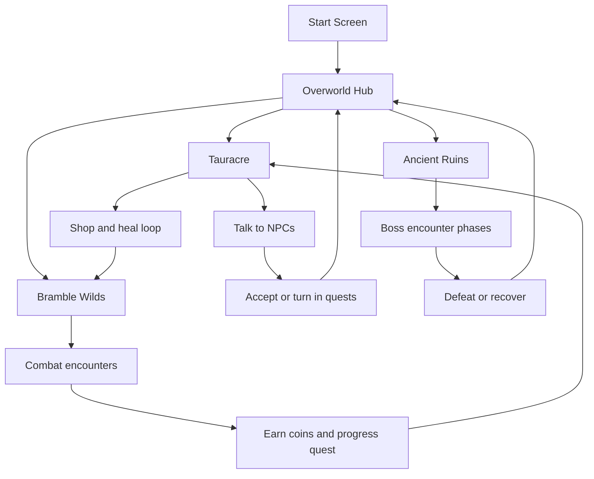

# PIXEL ORIGINS Design Document

## 1. Project Overview
**Title:** Pixel Origins  
**Genre:** 2D top-down action RPG (adventure, hack-and-slash, puzzle elements)  
**Engine:** Godot 4.6 (`gl_compatibility`)  
**Core fantasy:** Step outside your role and become the hero the world was not ready for.

Pixel Origins was developed through iterative milestones from Week 2 to Week 16. This document consolidates concept planning, prototype validation, alpha/beta decisions, final implementation outcomes, technical reflections, and credits.

## 2. Vision and Design Pillars (Week 2)
### Core gameplay loop goals
- Explore the world
- Defeat enemies
- Solve puzzles
- Take quests
- Overcome adversities

### Inspirations
- Evoland 1 and 2 (overall progression inspiration)
- Oceanhorn, Darkrise, Swordigo (arsenal and combat feel)
- Knights of Pen and Paper (quest framing)

### Original MVP intent
- Playable character with sword and shield combat
- Vision Visor + one puzzle-focused ability (bow or fire spark)
- Playable Starting Town and Overgrown Forest
- 3 to 5 main quests and 1 to 2 side quests

### Early out-of-scope boundaries
- Branching endings
- Deep leveling/stat systems
- Over-expansion of biomes/items/abilities

## 3. Milestone Progression

## Week 5: First Playable Prototype
### Prototype-confirmed systems
- WASD movement
- Left-click attack
- `E` interaction
- Basic enemy response using detection range

### Early technical findings
- Knockback tuning was harder than expected
- Stage transition flow needed centralized management
- Manual dialogue implementation was too slow and needed tooling support

### Scope update after prototype
- Focus narrowed to two weapons, one town, one biome, one enemy type

## Week 8: Alpha Planning
### Architecture baseline
- `StageManager` handled stage instantiation and spawn placement
- `SignalBus` handled gameplay-to-UI signaling
- Player and goblin were organized through FSM-style state nodes

### Alpha risks identified
- Hard-coded stage/spawn mapping
- Animation-frame-dependent damage windows
- Repeated state-input logic
- Placeholder stage scripts and scene wiring debt

## Week 12: Midterm State
### Systems delivered by midterm
- Quest tracking and quest modal
- Gold economy and HUD updates
- Start screen flow (`New Game`, `Continue`, `Quit`)
- Save/load persistence for stage, position, HP, and gold
- Dialogue-integrated quest acceptance/turn-in

### Midterm structure
- Enemy AI remained FSM + direct steering (no navmesh pathfinding)
- Progression remained quest/resource based (no level/stat tree)

## Week 15: Beta Lock (v3 Migration)
### Feature lock direction
- Trigger-based stage transitions and spawn routing
- Interaction centralized through `InteractionManager`
- Dialogue centralized through `DialogueService`
- Player loadout loop (sword/bow), coin pickups, NPC shop/heal/quest loops

### Major tradeoff
- Persistent disk save was reduced in v3 to session-state snapshot behavior to prioritize migration stability

### Beta concerns documented
- Scene conflict marker risks
- Incomplete defeat flow at the time
- Interaction overlap edge cases

## Week 16: Final Delivery
### Final additions and refinements
- Ancient Ruins stage and boss encounter
- Additional enemy/content support (boss, undead variants, life essence)
- Death recovery manager and checkpoint-aware stage return
- Sound manager integration (music + SFX routing)
- Final start screen, overworld, and polish revisions

## 4. Final Core Loop (Consolidated)

## 5. Systems Documentation (Final)
### 5.1 Player combat and interaction
- 4-direction movement and facing
- Sword attack with hit window
- Bow projectile attack
- Weapon slot switching and ownership checks
- Knockback and hurt-lock behavior
- Active quest, HP, coin, and inventory HUD display

### 5.2 Enemy AI and encounter model
- Base enemy framework for aggro, chase, return-to-spawn, and contact damage
- Goblin behavior with side-swing and charge adaptations
- Additional enemy variants and boss orchestration in final stage

### 5.3 Quest and progression
- NPC-bound quest state machine (available, in-progress, ready-to-turn-in, turned-in)
- Quest progress tied to enemy kill recording
- Reward loop through coin grants and economy interactions
- No full stat-leveling system by final scope

### 5.4 Stage, save, and death flow
- Stage routing through `StageManager` with stage IDs and spawn points
- Session-state snapshots captured through `SaveManager`
- Death recovery coordinated through `DeathManager` and checkpoint logic

### 5.5 Audio and feedback
- `SoundManager` for stage music and pooled SFX playback
- Contextual feedback for attack, pickup, enemy states, and UI actions

## 6. Architecture Evolution and Reflection
### Patterns that worked
- Manager/service autoload pattern for global orchestration
- Base-class reuse for enemy and NPC behaviors
- Event/signal communication for decoupled interactions
- Snapshot-style state capture for recovery workflows

### Architectural stress points
- Global manager coupling increased trace complexity
- Large scripts (notably player and boss) accumulated many responsibilities
- Data remained partly hard-coded (stage IDs, quest values, routing maps)

### If rebuilt again
- Split entity logic into smaller modules (movement, combat, animation, state)
- Shift more configuration to resources/data tables
- Formalize three save layers: runtime session, checkpoint, persistent profile
- Add automated checks for scene integrity and merge-conflict markers

## 7. Scope Changes and Feature Cuts
### Kept and completed
- Core traversal loop across multiple stages
- Combat with melee and ranged options
- NPC quest/shop/heal loops
- Boss encounter integration

### Reduced or cut
- Deep RPG progression (level/stat tree)
- Broad content expansion beyond stable vertical slice
- Full persistent save profile parity during v3 migration window

## 8. Playtesting and Iteration Summary
### Recurring friction points observed during development
- Progress-loss frustration and death-flow clarity
- Quest objective clarity and turn-in discoverability
- Combat readability and hit feedback

### Iterative responses
- Added quest tracking and clearer quest messaging
- Added stronger combat UI/SFX feedback loops
- Added stage/death recovery handling and checkpoint routing

## 9. Technical Debt and Known Risks
### Debt themes encountered across milestones
- Hard-coded routing/configuration
- Script size growth in high-complexity entities
- Refactor pressure from late architecture migration

### Residual risks to monitor post-course
- Maintainability of high-line-count scripts
- Coupling between global managers
- Long-term persistence strategy consistency

## 10. Code Statistics (from final snapshot)
- Total commits: **38**
- `refactor:` commits: **6**
- Project gameplay/content (excluding `addons/`):
  - `.gd`: 36 files, ~4,839 lines
  - `.tscn`: 21 files, ~24,800 lines
  - Total script+scene lines: ~29,639
- Including addon code/scenes:
  - 117 files across `.gd`, `.cs`, `.tscn`
  - ~42,709 total lines

## 11. Complete Credits
### Asset attributions (as documented)
- [Little Dreamyland Asset Pack](https://starmixu.itch.io/little-dreamyland-asset-pack) by Starmixu and Utaskuas
- [Dan's RPG Set](https://danieruart.itch.io/16x16-rpg-fantasy-character-and-tileset) by DanieruArt
- [Sunny side asset pack](https://danieldiggle.itch.io/sunnyside) by daniellediggle
- [Pixel Poem Dungeon](https://pixel-poem.itch.io/dungeon-assetpuck) by Pixel_Poem (support MiniPainter)
- [Monopixel Monsters](https://monopixelart.itch.io/) by MonoPixel
- [Broken Sword Asset Pack](https://from-chris.itch.io/broken-sword-asset-pack) by Chris
- [Pixel Crawler](https://anokolisa.itch.io/free-pixel-art-asset-pack-topdown-tileset-rpg-16x16-sprites) by Anokolisa
- [Super Retro World Character pack](https://gif-superretroworld.itch.io/character-pack) by Gif
- [RPG Dungeon Pack](https://gif-superretroworld.itch.io/dungeon-pack) by Gif (@gif_not_jif), Noiracide (@Noiracide), and Romi (@DessRomaric)
- [RPG Interior Pack](https://gif-superretroworld.itch.io/interior-pack) by The low-res arist (@Pixelart_asset)
- [Necromancer Boss Sheet](https://creativekind.itch.io/necromancer-free) by CreativeKind
- [Start Screen Background](https://stockcake.com/i/pixel-meadow-sunset_2513211_1497930) from StockCake
- Additional royalty-free music/SFX used from [Pixabay](https://pixabay.com/) and [Mixkit](https://mixkit.co/)

### Third-party code/plugins
- Dialogue Manager plugin (`addons/dialogue_manager`) by Nathan Hoad and contributors (MIT license)

### Playtester acknowledgments
- Blue Shell Studios expresses gratitude to the following:
  - CMSC 197 Game Design and Development Family
  - Adobo ni John Clyde
  - Sir Ren
- This project is made possible because of their feedback and support.

## 12. Final Postmortem Summary
Pixel Origins met its core objective as a playable action-RPG vertical slice with questing, progression, combat variation, multi-stage traversal, and a climactic boss sequence. The strongest outcomes came from iterative milestone reviews and decisive scope control. The biggest growth area was architecture planning cadence: earlier modularization and stronger data-driven systems would reduce late-stage migration load and improve long-term maintainability.