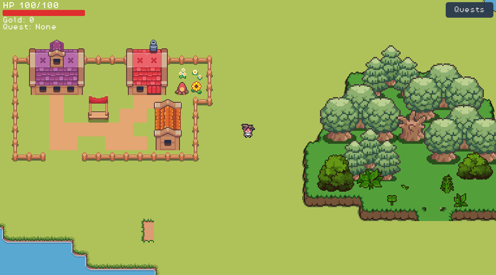
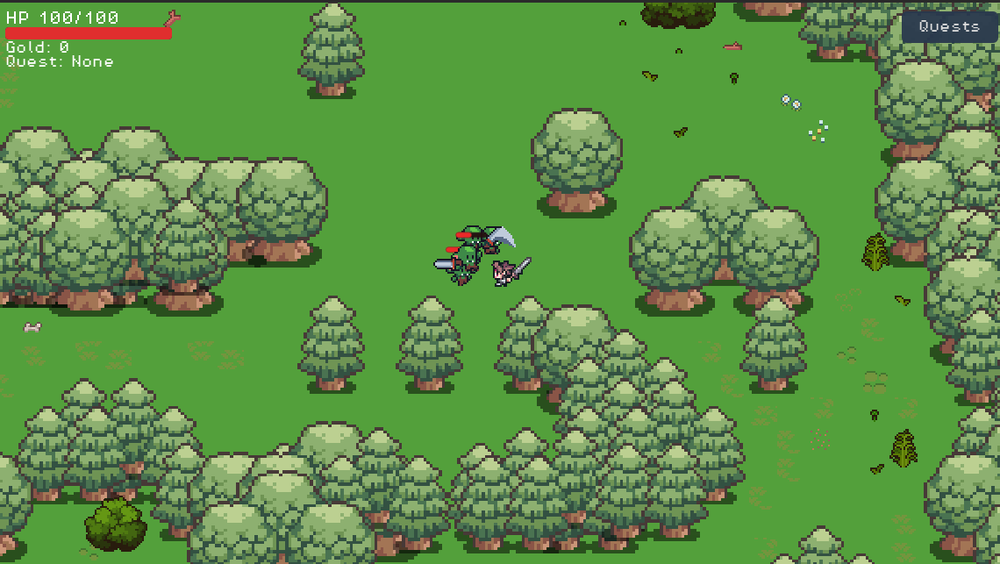
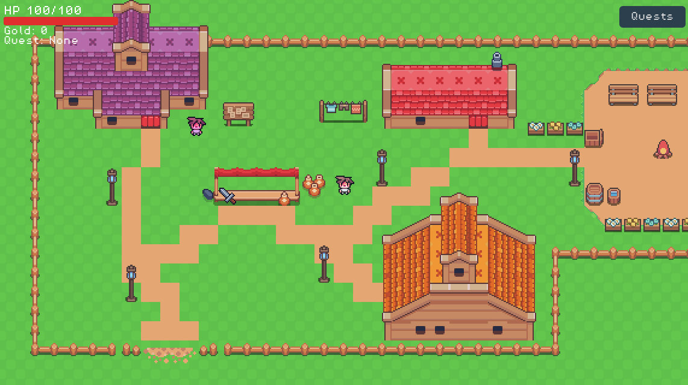
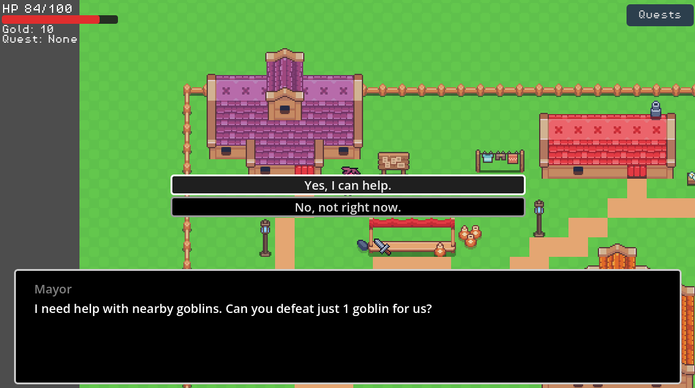

# Beta Version

## Feature Lock Status
### Final feature list
- Core stage flow in v3:
  - Start screen (`Play` / `Exit`)
  - Stage transitions via trigger-based entrances/exits and spawn IDs (`StageManager`).
- Player combat and controls:
  - 4-direction movement and facing
  - Sword attack with hit window
  - Bow attack with projectile arrows
  - Weapon slots (`1`/`2`) with ownership checks
  - Knockback + hurt lock feedback
- NPC interaction stack:
  - Global interaction focus (`InteractionManager`)
  - Prompt visibility tied to active interactable
  - Dialogue via `DialogueService` + Dialogue Manager
- Economy and rewards:
  - Coin drops from defeated enemies
  - Coin pickup magnet behavior
  - Coin spending for shop purchases
- Quest loop (implemented questline):
  - Scout Lyra goblin hunt (`5` kills, `10` coin reward)
  - Quest state markers (`!`, `?`) and progress summary in player HUD
- Utility NPC flows:
  - Shop Keeper Jacob: bow purchase
  - Maid Therese: healing interaction and heal prompt
- Enemy systems:
  - Base enemy aggro/chase/return/contact damage framework
  - Goblin side-swing + vertical charge behavior
  - Forest Wisp enemy prefab/script (available in codebase)

### What got cut and why
- Persistent save/load to disk was cut in v3 migration:
  - `SaveManager` now stores session state in memory only (health/coins/weapons across stage changes), not file-based save data.
  - Tradeoff: prioritize migration stability over full persistence.
- Old UI-heavy quest flow was reduced:
  - Previous dedicated HUD/quest modal flow is replaced by compact in-player HUD summary.
  - Tradeoff: lower integration complexity during refactor.
- Legacy mayor-dialogue quest path was replaced by NPC-managed runtime dialogue + Lyra quest state machine.
- Additional content scale appears intentionally constrained:
  - Slot 3 is deprecated in action bar.
  - Forest Wisp exists but is not clearly integrated into active stage encounter flow in this snapshot.

## Known Issues
### Bugs that won't be fixed by Week 16
- Critical scene-file merge artifacts exists:
  - `stages/overworld/overworld.tscn`, `stages/tauracre/tauracre.tscn`, and `stages/bramblewilds/bramble_wilds.tscn` contain unresolved conflict markers (`<<<<<<<`, `=======`, `>>>>>>>`).
  - These conflicts can break scene parsing/loading until manually resolved.
- Player defeat flow is incomplete:
  - On zero HP, player input/physics is disabled without full game-over/retry flow in this snapshot.
- Save continuity across app restarts is missing (session-only state, no persisted save file).

### Performance concerns
- Extremely large stage `.tscn` files (with duplicated/conflicted data blocks) increase load and editor/runtime overhead.
- Coin pickups run per-node tween + bob + rotation logic; high coin counts can add frame cost.
- Base NPC interaction state is refreshed every frame (`_process`) on each NPC, which may scale poorly with many interactables.

### Edge cases
- Interaction key overlap:
  - `ui_accept` is used for both interact and stage-enter prompts, which can cause unintended actions in overlap situations.
- Active interactable arbitration:
  - `InteractionManager` tracks one global active interactable; overlapping NPC ranges can cause prompt switching/flicker.
- Spawn application dependency:
  - StageManager spawn placement depends on `SpawnPoints/<id>` existing per stage; missing IDs silently degrade to fallback positioning.
- Quest state persistence gap:
  - Quest progress is runtime singleton state and may reset between sessions.

## Final Week Plan
### Bug fixing priorities
1. Resolve all scene merge conflicts in overworld, tauracre, and bramble_wilds `.tscn` files.
2. Re-validate stage loading/spawn transitions after conflict cleanup.
3. Implement a complete defeat loop (retry/return-to-menu) instead of control lock only.
4. Stabilize interaction priority handling when multiple interactables overlap.
5. Add minimal persistence fallback (or explicitly lock scope and document session-only behavior).

### Polish tasks (juice, sound, UI)
- Add hit/pickup/quest UI feedback polish:
  - clearer status messaging cadence
  - improved action-bar readability and selected-slot clarity
- Add or rebalance audio hooks for:
  - weapon swings
  - coin pickups
  - NPC interactions
- Visual juice pass:
  - tighter attack timing feedback
  - cleaner prompt transitions
  - small camera/impact feel improvements where safe.

### Presentation preparation
- Prepare a stable beta demo route:
  - Start screen -> Tauracre NPC loop -> Bramble Wilds combat -> quest turn-in -> shop/heal interactions.
- Document feature-lock decisions and explicit cuts (especially persistence scope).
- Prepare a known-issues slide with risk ownership and post-beta fix plan.
- Capture short gameplay clips/screenshots from the conflict-resolved build for Week 16 presentation.

### Screenshots
- Overworld

- Forest

- Town

- Quests
