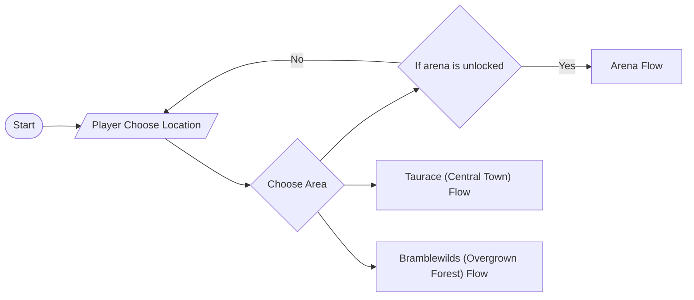
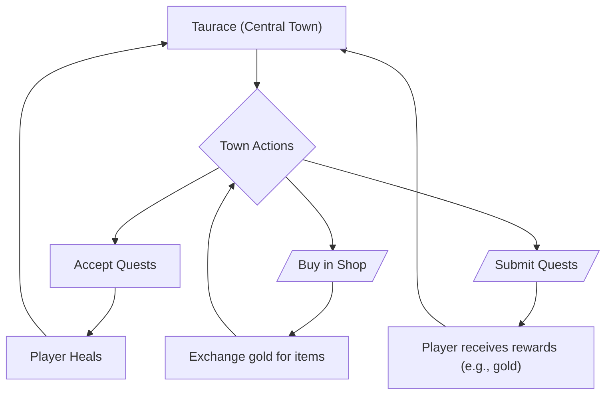
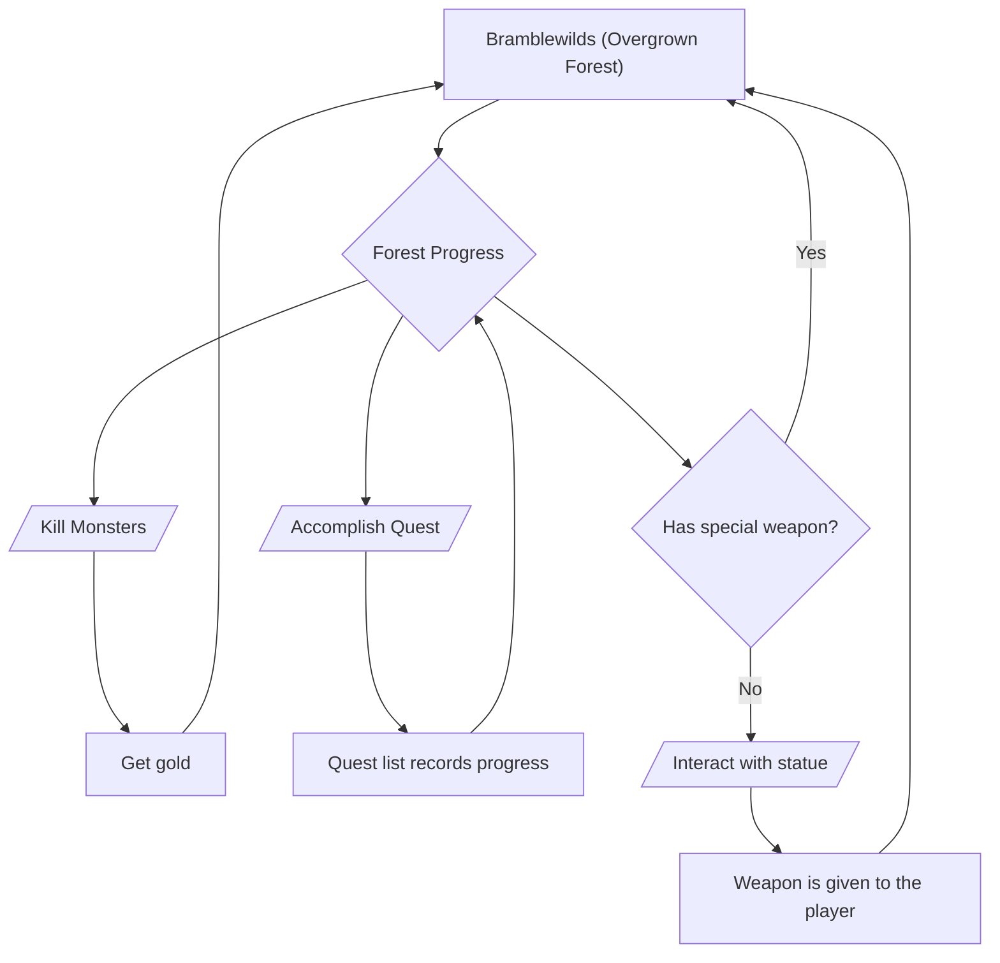
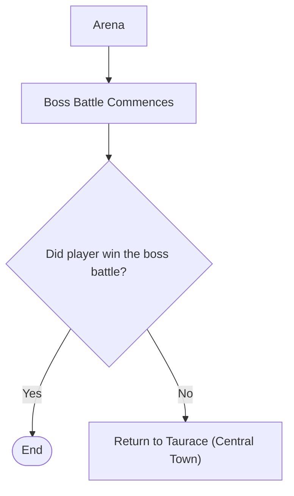

# First Playable Prototype

## Core Loop Diagram
### 1) Main Route Selection

### 2) Taurace (Central Town) Flow

### 3) Bramblewilds (Overgrown Forest) Flow

### 4) Arena Flow

## Control Scheme
### Movement (WASD)
- Use `W`, `A`, `S`, and `D` for basic movement.
- Since Pixel Origins is a 2D game with four-direction movement, this layout is practical and familiar for players.
- This scheme is widely used in popular games, including Minecraft and Oceanhorn (PC).
- With mouse-based interaction on the opposite hand, WASD remains the most ergonomic movement setup.

### Attack (Left Click)
- Use the left mouse button as the primary attack input.
- Left-click attack is a common and intuitive standard across many action games.

### Interaction (`E`)
- Use `E` to interact with NPCs, interactable world objects, and location entrances.
- `E` is close to WASD, making interactions easy to perform while using the mouse at the same time.

## Prototype Learnings
### Working Features During Playtesting
- The player can move and attack.
- Enemies detect the player using a field-of-vision trigger and begin attacking when the player enters that range.

### Features to Rework
- Manual dialogue setup is too tedious; consider using an addon such as Dialogue Manager 3.
- Current player attack presentation only supports left and right facing animations; we still need assets and implementation for up and down facing attacks.

### Technical Surprises
- Player knockback on damage is finicky and requires more precise collision setup and tuning.
- A stage manager is needed to handle player transitions between maps reliably.

## Updated Scope
Based on the prototype, the MVP is now focused on:
- Two weapons
- One town
- One biome
- One enemy type
