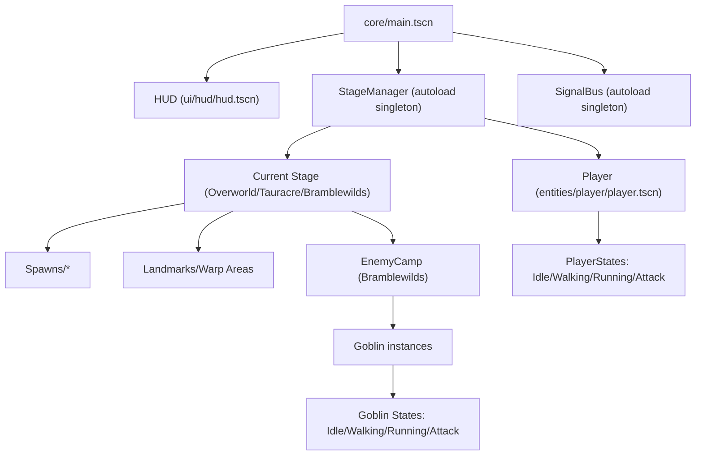
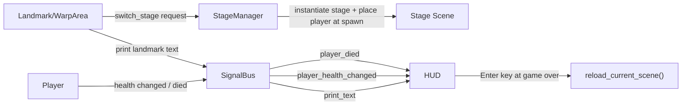

# Alpha Version

## Architecture Overview
### Scene hierarchy diagram

### Signal flow between major systems

### Design patterns in use
- State pattern:
  - `Player` uses `PlayerState` nodes (`Idle`, `Walking`, `Running`, `Attack`).
  - `Goblin` uses `GoblinState` nodes (`Idle`, `Walking`, `Runnning`, `Attack`).
- Observer / Event Bus pattern:
  - `SignalBus` centralizes gameplay/UI events (`print_text`, `player_health_changed`, `player_died`).
- Manager pattern:
  - `StageManager` owns stage instantiation, switching, and spawn placement.
- Scene composition pattern (Godot-native):
  - Stages, camps, entities, and HUD are composed from reusable scenes.
- Command-like interaction triggers:
  - `Landmark` and `WarpArea` act as interaction entry points that execute `switch_stage` commands.
  - This is lightweight command behavior (not a full command queue/undo system).

## Technical Debt Log
### Known issues or hacks
- Hard-coded stage registry and spawn-node paths in `StageManager`:
  - Stage list is manually mapped in code (`Util.StageName -> PackedScene`).
  - Spawn lookup relies on string paths such as `"Spawns/" + spawn_name`.
- Animation-coupled combat timing:
  - Attack states enable sword hitboxes at a hard-coded frame threshold (`frame < 5`).
- Input/state duplication:
  - Similar input polling logic exists across multiple player state scripts.
- Landmark interaction polling:
  - `Landmark._process()` uses `is_action_pressed("action")`, which can trigger repeatedly while held.
- Incomplete or placeholder scripts:
  - `stages/overworld/overworld.gd` and `stages/Stage.gd` still contain placeholder `pass` bodies.
- Camp signal mismatch risk:
  - `enemy_camp.tscn` connects `Vision.body_exited` to `_on_vision_body_exited`, but this method is not defined in `enemy_camp.gd` in this snapshot.

### Planned refactors
- Replace hard-coded stage dictionary with data-driven stage definitions (resource/config file).
- Introduce explicit spawn point resources/IDs to remove fragile string path lookups.
- Move attack hit timing to animation events (or per-weapon data) instead of magic frame numbers.
- Consolidate shared movement/transition checks into reusable helpers to reduce state script duplication.
- Change landmark interaction to `is_action_just_pressed("action")` with a small interaction cooldown/guard.
- Reconcile camp signal wiring and add defensive checks/tests for alert/retreat transitions.
- Define stage lifecycle hooks in `Stage.gd` (enter/exit/setup) so stage scripts stop being placeholders.

### Why these tradeoffs were made
- The team prioritized a playable vertical slice first:
  - Stage-to-stage traversal,
  - Combat loop,
  - Enemy response,
  - Basic HUD feedback.
- Hard-coded mappings and direct signal wiring reduced setup time and debugging overhead during rapid prototyping.
- Animation-frame-driven hit windows were fast to implement and good enough for initial playtesting before weapon systems were finalized.
- Placeholder stage scripts allowed scene/content iteration without blocking core loop delivery.

## Alpha Goals
### What features should work by Week 12
- End-to-end playable loop:
  - Start in hub (`Overworld`), travel to `Tauracre` and `Bramblewilds`, then return reliably.
- Stable player controls and combat:
  - Walking/running/attacking transitions work consistently.
  - Melee hit detection and damage exchange are reliable.
- Enemy camp encounter quality:
  - Goblins correctly aggro, chase, attack, disengage, and retreat.
- HUD completeness for alpha:
  - Health updates, contextual landmark text, and game-over/restart flow all work without manual resets.
- Basic balance pass:
  - Player and goblin health/damage/speed values tuned for fair encounters in Bramblewilds.
- Reduced transition bugs:
  - Spawn points always place the player correctly after stage changes.

### What's still placeholder / programmer art
- UI presentation is still utilitarian:
  - Plain health bar/labels and simple game-over overlay.
- Some scene scripts remain scaffolding-level (`Stage.gd`, `overworld.gd`) and need production logic.
- Interaction and combat timing still rely on prototype-style hard-coded values.
- Visual polish is limited in this snapshot:
  - Effects, juice, and higher-fidelity feedback are not yet at final-art quality.
